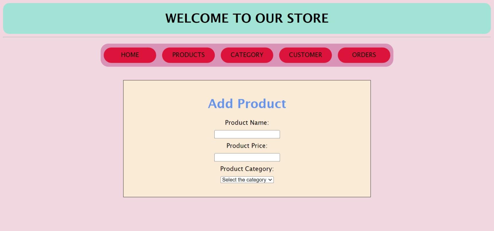

## A PHP E Commerce application

The PHP E-Commerce Application is designed to provide users with the ability to browse and select products from a database, place orders, create product categories, and manage customer information. It also offers a way of adding new products and categories to the store. 

